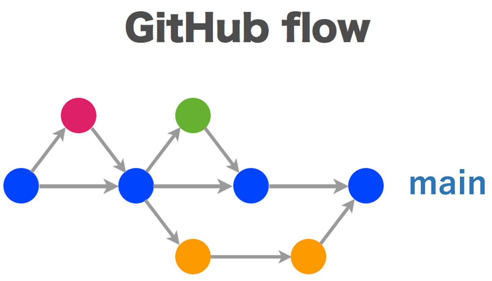

# ブランチ戦略

GitHub flowを採用します。
GitHub flowは、featureブランチとmainブランチしか使わないシンプルでわかりやすいフローです。

全てをmainブランチにマージし、こまめにデプロイすることで、デプロイ待ちのコードの量を最小限にできます。

## ルール

GitHub Flowには以下の6つのルールがあります。1が最も重要で、それ以外のルールは1を実現するために存在します。

1. mainブランチは常にデプロイ可能であること
2. 作業用ブランチはmainブランチから作成すること
3. 作業用ブランチを定期的にプッシュすること
4. プルリクエストを活用すること
5. プルリクエストが承認されたらmainへマージすること
6. mainへのマージが完了したら直ちにデプロイすること

## 開発の流れ

### 1. mainブランチのcloneもしくはpull

作業開始時にリモートのmainブランチをローカルにcloneします。
以前にclone済みであれば、最新化するためにpullしてください。

### 2. 作業用ブランチ(featureブランチ)の作成

git-flowでは、"feature,"release","hotfix"のいずれかのブランチをmainまたはdevelopブランチから作成しますが、GitHub Flowでは、全てのブランチをmainブランチから作成します。

ブランチ名は、何の作業を行っているかが分かる名前にします。

### 3. ローカルで開発

ローカルの作業ブランチにて開発を行います。
定期的にmainブランチをpullし、更新を取り込むようにしてください。

ローカルでのテストが完了したら、手動でdev環境へデプロイし、dev環境でもテストをしてください。

### 4. 作業用ブランチをリモートへPush

開発途中であっても、作業用ブランチは定期的にリモートリポジトリにプッシュするようにします。これによって、開発者同士がお互いの作業状況を把握しやすくなります。

### 5. mainブランチへのPR

作業用ブランチをmainブランチへmergeできる状態になったら、PRを作成して他の開発者にコードレビューを依頼します。

PRがされると自動でCIが実行され、結果がPRにコメントされます。

### 6. PRのmerge

プルリクエストが承認されたらmainへマージします。

mainへマージすると、自動でbeta環境へリリースされます。

### 7. バージョンタグ発行

本番環境へのリリースが決まったら、バージョンタグを発行します。

バージョンタグが発行されると、自動でprod環境へリリースされます。

## CI/CD

上記`開発の流れ`の中で説明されている、CI/CD部分をまとめると以下のようになります。

|No.|環境|Integration|Delivary|だれが|トリガー|
|--:|:--:|:--|:--|:--|:--|
|1|dev|○|○|開発者|任意のタイイング|
|2|beta, prod|○|-|GitHub Actions|mainブランチへのPR作成|
|3|beta|-|○|GitHub Actions|mainブランチへのmerge|
|4|prod|-|○|GitHub Actions|タグ付け|
