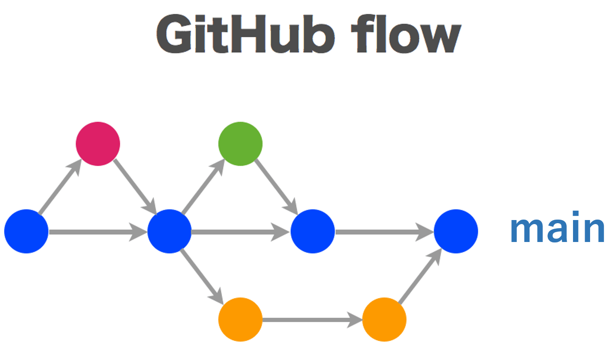

# ブランチ戦略

ブランチ戦略はGitHub flowを採用します。
GitHub flowは、featureブランチとmainブランチしか使わないシンプルでわかりやすいフローです。

全てをmainブランチにマージし、こまめにデプロイすることで、デプロイ待ちのコードの量を最小限にできます。

## ルール

GitHub Flowには以下の6つのルールがあります。1が最も重要で、それ以外のルールは1を実現するために存在します。

1. mainブランチは常にデプロイ可能であること
2. 作業用ブランチはmainブランチから作成すること
3. 作業用ブランチを定期的にプッシュすること
4. プルリクエストを活用すること
5. プルリクエストが承認されたらmainへマージすること
6. mainへのマージが完了したら直ちにデプロイすること

## 開発フローの例

### 1. 開発作業を行う

作業開始時に作業用ブランチをmainブランチから作成します。
git-flowでは、"fiture","release","hotfix"のいずれかのブランチをmainまたはdevelopブランチから作成しますが、GitHub Flowでは、全てのブランチをmainブランチから作成します。

ブランチ名は、何の作業を行っているかが分かる名前にします。また、作業用ブランチは定期的にリモートリポジトリにプッシュするようにします。これによって、他の開発者の作業状況を把握できるようになります。

### 2. プルリクエストを行う

作業用ブランチをmainブランチへマージできる状態になったら、プルリクエストを作成して他の開発者にコードレビューを依頼します。そして、プルリクエストが承認されたらmainへマージします。

GitHub Flowを使用した開発では、プルリクエストを積極的に活用します。作業完了後のコードレビューだけではなく、作業途中の実装への助言を求める場合などにも使えます。

### 3. デプロイする

mainへのマージが完了したら直ちにデプロイをします。
